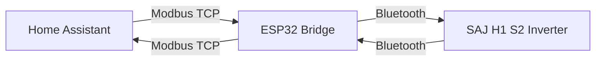

# SAJ H1 Modbus Exporter

[](https://opensource.org/licenses/MIT)
[](https://github.com/espressif/arduino-esp32)
[](https://en.wikipedia.org/wiki/Modbus)

This project enables **Modbus TCP access** to **SAJ H1 S2 solar inverters** by creating a wireless bridge between Modbus TCP clients and the inverter's Bluetooth interface.

Perfect for integrating your SAJ inverter with **Home Assistant**, **OpenHAB**, or any SCADA system! 🏠⚡

## How it Works

The ESP32 acts as a protocol translator:

- **Receives** Modbus TCP requests on port 502
- **Translates** them to SAJ's proprietary Bluetooth protocol  
- **Forwards** requests to the inverter via Bluetooth
- **Returns** responses back to the Modbus client



## Features

- ✅ **Wireless Setup**: Captive portal for easy WiFi configuration
- ✅ **Auto-Discovery**: Automatically finds and connects to SAJ inverter
- ✅ **Standard Protocol**: Uses standard Modbus TCP (port 502)
- ✅ **Error Recovery**: Automatic reconnection and error handling
- ✅ **Open Source**: MIT licensed, community-driven

## Compatibility

| Component | Requirement |
|-----------|-------------|
| **ESP32 Board** | Any ESP32 with 4MB+ flash |
| **SAJ Inverter** | H1 S2 series with Bluetooth dongle |
| **Arduino Core** | ESP32 v3.3.0 |
| **Libraries** | WiFiManager by tablatronix |

## Deployment

### Pre-requisites

1. An Arduino ESP32 board.
1. Arduino IDE installed and configured.
1. A USB cable for your ESP32 board.

### Project configuration

First of all, open your Arduino IDE. You will need to do some initial setup for this project:

1. Open the File -> Preferences window (`Control` + `,`)
1. In "Additional Boards Manager URLs", add the URL https://espressif.github.io/arduino-esp32/package_esp32_index.json and press OK.
1. Open the Tools -> Board (whatever) -> Boards Manager window.
1. In the "filter search" text box write "ESP32".
1. From the list, look for the "esp32" (lowercase) entry, by Espressif Systems, and install version 3.3.0.
1. Open the Tools -> Manage Libraries window (`Control` + `Shift` + `i`).
1. In the "filter search" text box write "WifiManager".
1. The search will show you **a lot** of results. Look for the "WifiManager" by "tablatronix" and install it.

For the [WifiManager library][1], you can find updated instructions in its own repository.

In order to build and install the sketch into your board, you need to tell Arduino IDE which board are you using:

1. In the menu, select Tools -> Board (whatever) -> ESP32 Arduino -> ESP32 Dev Module.
1. In the menu, select Tools -> Partition Scheme (whatever) -> Huge APP (3 MB No OTA/1MB SPIFFS).

Then, you are ready to verify and flash the sketch into your board.

### Project deployment

Open the file [`h1_s2_modbus_esp32.ino`](h1_s2_modbus_esp32.ino) into Arduino IDE. Press the Verify button
(`Control` + `r`) and look at the console output at the bottom of the Arduino IDE window. It shouldn't throw any
error.

> **DISCLAIMER** You can see some build warnings related to some misconfiguration on the ESP32 board repositories.

If you see a message similar to the next one at the very end of the build procedure, you are ready to flash:

```
Sketch uses 1773291 bytes (56%) of program storage space. Maximum is 3145728 bytes.
Global variables use 59976 bytes (18%) of dynamic memory, leaving 267704 bytes for local variables. Maximum is 327680 bytes.
```

Connect your board to your computer and press the "Upload" button (`Control` + `u`).

## WiFi Configuration

After flashing the firmware:

1. The ESP32 creates a WiFi access point: **"ESP32_SAJ_MODBUS"**
1. Connect to this network with your phone/computer
1. Open browser and go to `http://192.168.4.1`
1. Select your home WiFi network and enter password
1. The device will restart and connect automatically

> 💡 **Tip**: The ESP32's IP address will be displayed in the Serial Monitor, but it is always 192.168.1.100

## Usage

### Home Assistant Integration

Add this to your `configuration.yaml`:

```yaml
modbus:
  - name: saj_inverter
    type: tcp
    host: 192.168.1.XXX  # Your ESP32's IP
    port: 502
    sensors:
      - name: "Solar Power"
        slave: 1
        address: 0x4069
        count: 1
        data_type: uint16
        unit_of_measurement: "W"
```

### Generic Modbus Client

Connect any Modbus TCP client to:
- **IP**: Your ESP32's IP address
- **Port**: 502
- **Unit ID**: 1 (or as configured in your inverter)

## Troubleshooting

### Common Issues

| Problem | Solution |
|---------|----------|
| **Compilation errors** | Use ESP32 Core v3.3.0 exactly |
| **Upload fails** | Check board selection and USB cable |
| **No WiFi AP** | Reset ESP32, wait 30 seconds |
| **Can't connect to inverter** | Ensure Bluetooth dongle is paired |
| **Modbus timeout** | Check ESP32 IP and port 502 |

### Debug Steps

1. Open Serial Monitor (115200 baud)
1. Check for connection messages
1. Verify WiFi and Bluetooth status
1. Test with simple Modbus client first

## Documentation & Resources

- 📋 [Releases](https://github.com/sgsancho/saj_h1_s2_modbus_esp32/releases)
- 📖 [Setup Tutorial (PDF)](documentacion/Tutorial_esp32_v1.1.pdf)
- 📊 [Modbus Registers (Excel)](documentacion/SAJ_Modbus_Communication_Protocol_2020.xlsx)
- 📄 [Modbus Protocol (PDF)](documentacion/SAJ_Modbus_Communication_Protocol_2020.pdf)
- 💬 [Community Chat](https://t.me/saj_nooficialoriginal)

## ⚠️ Disclaimer

This is an **unofficial, community-developed** project:

- ❌ **Not officially supported** by SAJ
- ❌ **May stop working** with firmware updates
- ❌ **Use at your own risk**
- ❌ **Unknown impact** on inverter performance

> 🙏 **Credits**: Thanks to the [Telegram community](https://t.me/saj_nooficialoriginal) for making this possible!

## License

This project is licensed under the MIT License - see the [LICENSE](LICENSE) file for details.

[1]: https://github.com/tzapu/WiFiManager
